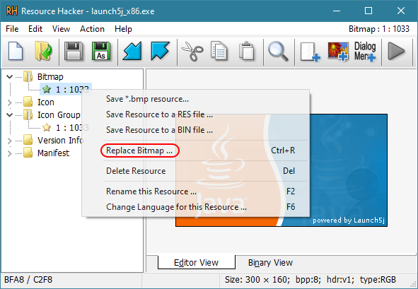
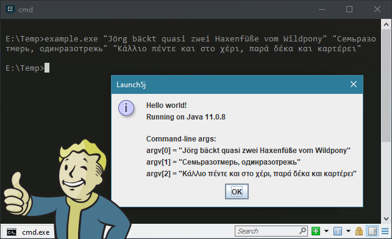

**Java JAR file wrapper for creating Windows native executables**

# Introduction

**Launch5j** is a reimagination of “Launch4j”, *with full Unicode support*. This is a tool for wrapping Java applications distributed as JARs in lightweight Windows native executables. The executable can be configured to search for a certain JRE version or use a bundled one. The wrapper also provides better user experience through an application icon, a native pre-JRE splash screen, and a Java download page in case the appropriate JRE cannot be found.

# Usage

There currently are two different ways to use Launch5j with your application code:

* **Use the launcher executable with a separate JAR file**  
  
  Simply put the launcher executable (`launch5j.exe`) and your JAR file into the same directory. Launch5j will automatically detect the path of the JAR file based on the location of the executable file. More specifically, Launch5j detects the full path of the executable file and then replaces the `.exe` file extension with a `.jar` file extension. Of course, you can rename the `launch5j.exe` executable to whatever you prefer.
  
  ***For example:*** Assuming your application's JAR file is called `thingamabob.jar`, pick the Launch5j launcher variant of your choice (**no** `wrapped` variant though!), rename the launcher executable to `thingamabob.exe`, and put these two files into the “install” directory. Also, the Java runtime should be located in the `runtime` sub-directory within the “install” directory &ndash; unless you are using the `registry` variant of Launch5j.

  ```
  install_dir
  ├── thingamabob.exe
  ├── thingamabob.jar
  ├── runtime
  │   └── bin
  │       ├── java.exe
  │       ├── javaw.exe
  │       └── [...]
  └── [...]
  ```

* **Combine the launcher executable and the JAR file (“wrapping”)**  
  
  In order to combine the Launch5j launcher executable and the JAR file to a ***single*** file, you can simply *concatenate* these two files. For this purpose, you have to choose one of the `wrapped` variants of Launch5j. Also, the executable launcher code must go before the JAR file content. There are many ways to achieve this, but probably the most simple method is running the following **copy** command-line in the terminal:
  
      copy /B launch5j_wrapped.exe + thingamabob.jar thingamabob.exe
  
  If you are building your application with [**Apache Ant**](https://ant.apache.org/), consider using the `concat` task like this:
  
      <concat destfile="thingamabob.exe" binary="true">
         <fileset file="launch5j_wrapped.exe"/>
         <fileset file="thingamabob.jar"/>
      </concat>

  The resulting `thingamabob.exe` is fully self-contained, **no** separate JAR file needs to be shipped. Still, a Java runtime is required to run the application! The Java runtime should be located in the `runtime` sub-directory within the “install” directory &ndash; unless you are using the `registry` variant of Launch5j.

  ```
  install_dir
  ├── thingamabob.exe
  ├── runtime
  │   └── bin
  │       ├── java.exe
  │       ├── javaw.exe
  │       └── [...]
  └── [...]
  ```

  **Warning:** Code signing, as with Microsoft&reg;'s `SignTool`, probably does **not** work with the “wrapped” executable file! If code signing is a requirement, please use a *separate* JAR file and just sing the launcher executable.


# Variants

Launch5j executables come in a number of variants, allowing you to pick the most suitable one for your project:

* **`nogui`**  
  No graphical user interface is created and the Java application is launched via the `java.exe` (console mode) program; default variant launches the Java application via the `javaw.exe` (windowed mode) program.
  
  *Note:* If using this variant, the program should be called from within a terminal window!

* **`wrapped`**  
  Expects that the JAR file and the executable launcher have been combined to a *single* file; default variant expects that a separate JAR file is present in the same directory where the executable launcher resides.

* **`registry`**  
  Tries to automatically detect the install path of the JRE from the Windows registry; default variant expects the JRE to be located in the `runtime` path relative to the location of the executable launcher.
  
  At this time, the following Java distributions can be detected from the registry:
  - [Oracle JDK (JavaSoft)](https://www.oracle.com/java/technologies/javase-downloads.html)
  - [AdoptOpenJDK](https://adoptopenjdk.net/)
  - [Liberica OpenJDK](https://bell-sw.com/)
  - [Zulu OpenJDK](https://www.azul.com/downloads/zulu-community/)

  Regarding the different available distributions of Java, please refer to this document:  
  [***Java Is Still Free***](https://docs.google.com/document/d/1nFGazvrCvHMZJgFstlbzoHjpAVwv5DEdnaBr_5pKuHo/preview)

* **`nowait`**  
  Does **not** keep the launcher executable alive while the application is running; default variant keeps the launcher executable alive until the application terminates and then forwards the application's exit code.

* **`nosplash`**  
  Does **not** display a splash screen while the application is launching; default variant *does* display a splash screen while the application is launching &ndash; will be hidden as soon as application window shows up.

* **`noenc`**  
  Does **not** apply [URL encoding](https://en.wikipedia.org/wiki/Percent-encoding) to the given command-line arguments; default variant *does* apply URL encoding to all given command-line arguments in order to work around a long standing bug in Java.

## Supported platforms

All of the above Launch5j variants are available as `x86` (32-Bit) and `x64` (64-Bit) executables. The `x86` (32-Bit) executables can run on *32-Bit* and *64-Bit* versions of Microsoft&reg; Windows&trade;, whereas the `x64` (64-Bit) executables require a *64-Bit* version of Microsoft&reg; Windows&trade;. Consequently, it is generally recommended to distribute the `x86` (32-Bit) launcher executable. Please note that this does **not** restrict the “bitness” of the JRE that can be used. Even the `x86` (32-Bit) launcher executable is perfectly able to detect and launch a *64-Bit* JRE &ndash; if it is available.

*Note:* Launch5j has been tested to work correctly on Windows XP (Service Pack 2), or a compatible newer version.


# Customizations

Launch5j comes with a *default* executable icon and a *default* splash screen bitmap. These just server as an example and you probably want to replace them with your own *application-specific* graphics.

It is ***not*** necessary to re-build the executable files for that purpose. Instead, you can simply use a resource editor, such as [**XN&nbsp;Resource Editor**](https://web.archive.org/web/20100419201225/http://www.wilsonc.demon.co.uk/d10resourceeditor.htm) ([mirror](https://stefansundin.github.io/xn_resource_editor/)) or [**Resource Hacker&trade;**](http://www.angusj.com/resourcehacker/), to *modify* the pre-compiled executable files as needed:  



## Additional options

Some options can be configured via the launcher executable's [STRINGTABLE](https://docs.microsoft.com/en-us/windows/win32/menurc/stringtable-resource) resource:

* **`ID_STR_HEADING` (#1)**  
  Specifies a custom application title that will be used, e.g., as the heading of message boxes.

* **`ID_STR_JVMARGS` (#2)**  
  Specifies *additional* options JVM options to be passed, such as `-Xmx2g` or `-Dproperty=value`.  
  See here for a list of available options:  
  <https://docs.oracle.com/javase/7/docs/technotes/tools/windows/java.html>

* **`ID_STR_CMDARGS` (#3)**  
  Specifies *additional* fixed command-line parameters to be passed to the Java application.  

* **`ID_STR_JREPATH` (#4)**  
  Specifies the path to the Java runtime (`javaw.exe`) relative to the launcher executable location.
  If not specified, then the *default* runtime path `runtime\\bin\\javaw.exe` is assumed.

  (This option does **not** apply to the “registry” variant of Launch5j)

* **`ID_STR_MUTEXID` (#5)**  
  Specifies the application ID to be used when creating the [*single-instance*](http://www.bcbjournal.org/articles/vol3/9911/Single-instance_applications.htm) mutex.  
  The ID **must** be at least 5 characters in length and **should** be a *unique* string for each application!  
  If not specified, then **no** mutex will be created and thus *multiple* instances will be allowed.
  
  *Hint:* If the specified application ID *starts* with an **`@`** character, then Launch5j will **not** show a message box when the application is already running; the **`@`** character is *not* considered a part of the actual ID.

  (This option does **not** apply to the “nowait” variant of Launch5j)

* **`ID_STR_JAVAMIN` (#6)**  
  Specifies the ***minimum*** supported JRE version, in the **`w.x.y.z`** format (e.g. `11.0.0.0`).  
  This values is *inclusive*, i.e. the specified JRE version or any newer JRE version will be accepted.  
  If not specified, then the *default* minimum supported JRE version `8.0.0.0` applies.

  *Hint:* Old-style `1.x.y_z` Java versions  are automatically translated to the new `x.y.z` format!

  (This option only applies to the “registry” variant of Launch5j)

* **`ID_STR_JAVAMAX` (#7)**  
  Specifies the ***maximum*** supported JRE version, in the **`w.x.y.z`** format (e.g. `12.0.0.0`).  
  This values is *exclusive*, i.e. only JRE versions *older* than the specified JRE version will be accepted.  
  If not specified, then there is **no** upper limit on the supported JRE version.
  
  *Hint:* Old-style `1.x.y.z` Java versions are automatically translated to the `x.y.z.0` format!
  
  (This option only applies to the “registry” variant of Launch5j)

* **`ID_STR_BITNESS` (#8)**  
  Specifies the required ***bitness*** of the JRE. This can be either **`32`** (x86, aka i586) or **`64`** (x86-64).  
  If not specified, then 32-Bit *and* 64-Bit JREs are accepted, with a preference to 64-Bit.
  
  (This option only applies to the “registry” variant of Launch5j)

* **`ID_STR_JAVAURL` (#9)**  
  The Java download URL that will ne suggested, if **no** suitable JRE could be detected on the machine.  
  If not specified, wes suggest downloading OpenJDK as provided by the [AdoptOpenJDK](https://adoptopenjdk.net/) project.

  *Hint:* The URL must begin with a `http://` or `https://` prefix; otherwise the URL will be ignored!

  (This option only applies to the “registry” variant of Launch5j)

*Note:* We use the convention that the default resource string value `"?"` is used to represent an “undefined” value, because resource strings cannot be empty. You can replace the default value as needed!


# Unicode command-line arguments

There is a *long-standing* bug in Java on the Windows&trade; platform, which causes *Unicode* command-line arguments to be “mangled”. Even if the Unicode command-line arguments are properly passed to the Java executable (`java.exe`), they are **not** passed trough correctly to the `main()` method of your Java program! This problem can be reproduced in *all* Java versions ranging from Java 7 (1.7) up to and including the latest Java 15, as of October 2020.

More specifically, Java replaces any characters in the given command-line arguments that can **not** be represented in the computer's *local* ANSI codepage (i.e. pretty much any *non*-ASCII characters) with **`?`** characters. The cause of the problem apparently is that the “native” C code of the Java executable still uses the *legacy* `main()` entry point instead of the [`wmain()`](https://docs.microsoft.com/en-us/cpp/c-language/using-wmain?view=vs-2015) entry point; the latter is the modern Unicode-aware entry point &ndash; which **should** be used by programs written for *Windows 2000 or later*. Why this has **not** been fixed in 20 years is beyond my understanding.

As a workaround for the current situation in Java, Launch5j will (by default) convert the given Unicode command-line arguments to the [UTF-8](https://en.wikipedia.org/wiki/UTF-8) format and then apply the [URL encoding](https://en.wikipedia.org/wiki/Percent-encoding) scheme. This ensures that *only* pure ASCII characters need to be passed to the Java executable, thus preventing the command-line arguments from being “mangled”. Still the original Unicode command-line arguments are preserved and *can* be reconstructed in the Java code.

The only downside is that a bit of additional processing is required in the application code. The command-line arguments can be decoded by using the `URLDecoder.decode()` method with the **UTF-8** charset. Also, applications should check the `l5j.encargs` system property before decoding the command-line arguments:

```java
public class MainClass {
    public static void main(final String[] args) {
        initCommandlineArgs(args);
        /* Your application code goes here! */
    }

    private static void initCommandlineArgs(final String[] argv) {
        if (boolify(System.getProperty("l5j.encargs"))) {
            final String enc = StandardCharsets.UTF_8.name();
            for (int i = 0; i < argv.length; ++i) {
                try {
                    argv[i] = URLDecoder.decode(argv[i], enc);
                } catch (Exception e) { }
            }
        }
    }

    /* ... */
}
```

***Example:***



Please refer to the file **`example/example.java`** for the *complete* example code!

## JAR file name

Be aware that the same problem of “mangled” Unicode characters applies when the path of the JAR file is passed to the Java executable. In other words, the Java runtime *fails* to execute any JAR files whose path &ndash; file name or any directory name in the path &ndash; contains any Unicode characters that cannot be represented in the computer's *local* ANSI codepage! Unfortunately, we can **not** encode the path of the JAR file as we do with the other command-line arguments, because the Java executable requires the path of the JAR file to be passed in a non-encoded form.

Therefore, it is recommended to ***only*** use ASCII characters in the name of your JAR file and in the “install” path !!!

# Command-line options

The launcher executable recognizes the following “special” command-line options:

* **`--l5j-about`**:  
  Display Launch5j about dialogue; includes version information and build configuration

* **`--l5j-slunk`**:  
  Enable experimental “slunk” mode; this is for experts only!


# Source code

The source code of **Launch5j** is available from the official Git mirrors at:

* `git clone https://github.com/lordmulder/Launch5j.git`

* `git clone https://bitbucket.org/muldersoft/launch5j.git`

* `git clone https://gitlab.com/lord_mulder/launch5j.git`


# Build instructions

In order to build **Launch5j** from the sources, it is recommended to use the [*GNU C Compiler* (GCC)](https://gcc.gnu.org/) for Windows, as provided by the [*Mingw-w64*](http://mingw-w64.org/) project. Other C compilers may work, but are **not** officially supported.

Probably the most simple way to set up the required build environment is by installing the [**MSYS2**](https://www.msys2.org/) distribution, which includes *GCC* (Mingw-w64) as well as all the required build tools, such as *Bash*, *GNU make* and *Git*.

Please make sure that the essential development tools and the MinGW-w64 toolchains are installed:

    $ pacman -S base-devel git
    $ pacman -S mingw-w64-i686-toolchain mingw-w64-x86_64-toolchain

Once the build environment has been set up, just run the provided Makefile:

    $ cd /path/to/launch5j
    $ make

*Note:* In order to create 32-Bit or 64-Bit binaries, use the `mingw32` or `mingw64` sub-system of MSYS2, respectively.


# Contact

**Launch5j** was created by LoRd_MuldeR &lt;<mulder2@gmx.de>&gt;.

For help and support, please visit:  
<https://github.com/lordmulder/Launch5j/issues>

# Acknowledgment

This project is partly inspired by the “Launch4j” project, even though it has been re-written from scratch:  
<https://sourceforge.net/p/launch4j/>


# License

This work has been released under the MIT license:

    Copyright 2020 LoRd_MuldeR <mulder2@gmx.de>

    Permission is hereby granted, free of charge, to any person obtaining a copy of
    this software and associated documentation files (the "Software"), to deal in
    the Software without restriction, including without limitation the rights to
    use, copy, modify, merge, publish, distribute, sublicense, and/or sell copies of
    the Software, and to permit persons to whom the Software is furnished to do so,
    subject to the following conditions:

    The above copyright notice and this permission notice shall be included in all
    copies or substantial portions of the Software.
    
    THE SOFTWARE IS PROVIDED "AS IS", WITHOUT WARRANTY OF ANY KIND, EXPRESS OR
    IMPLIED, INCLUDING BUT NOT LIMITED TO THE WARRANTIES OF MERCHANTABILITY, FITNESS
    FOR A PARTICULAR PURPOSE AND NONINFRINGEMENT. IN NO EVENT SHALL THE AUTHORS OR
    COPYRIGHT HOLDERS BE LIABLE FOR ANY CLAIM, DAMAGES OR OTHER LIABILITY, WHETHER
    IN AN ACTION OF CONTRACT, TORT OR OTHERWISE, ARISING FROM, OUT OF OR IN
    CONNECTION WITH THE SOFTWARE OR THE USE OR OTHER DEALINGS IN THE SOFTWARE.


[&#8718;](https://www.youtube.com/watch?v=EfbbjY9MlQs)
